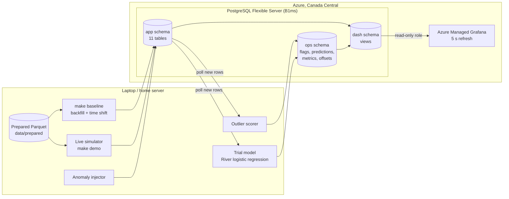
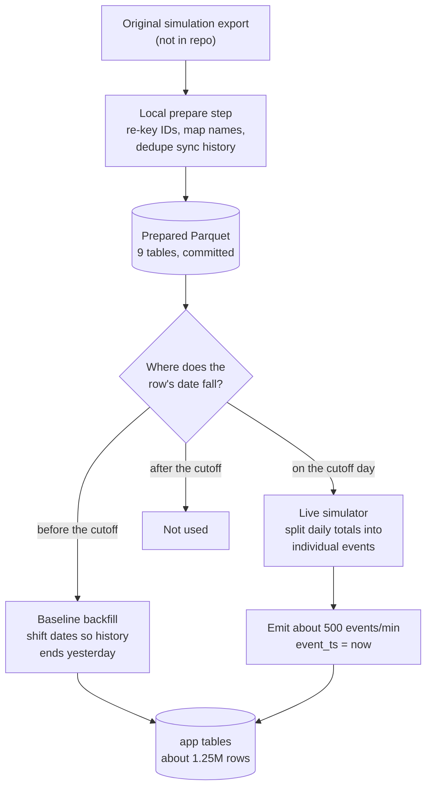
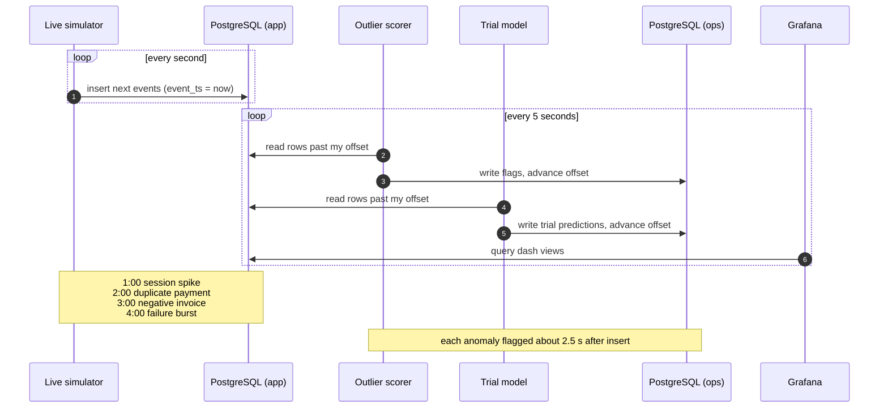
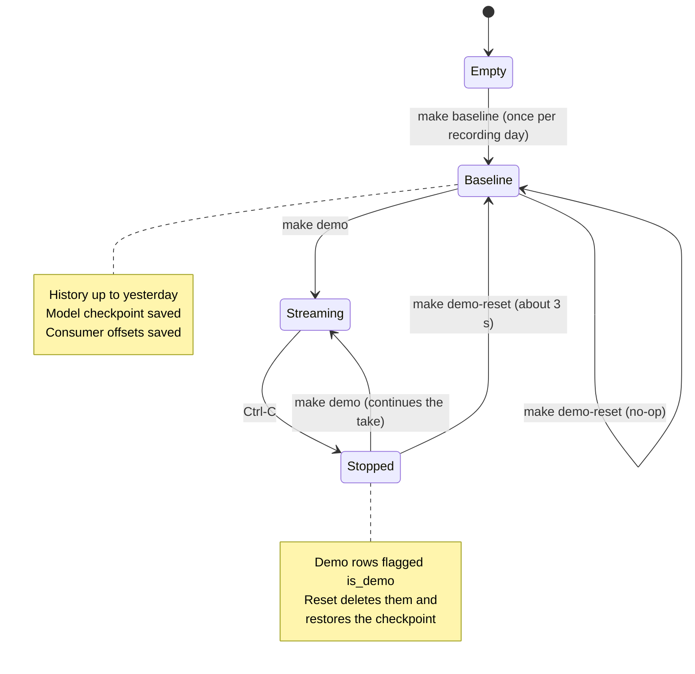
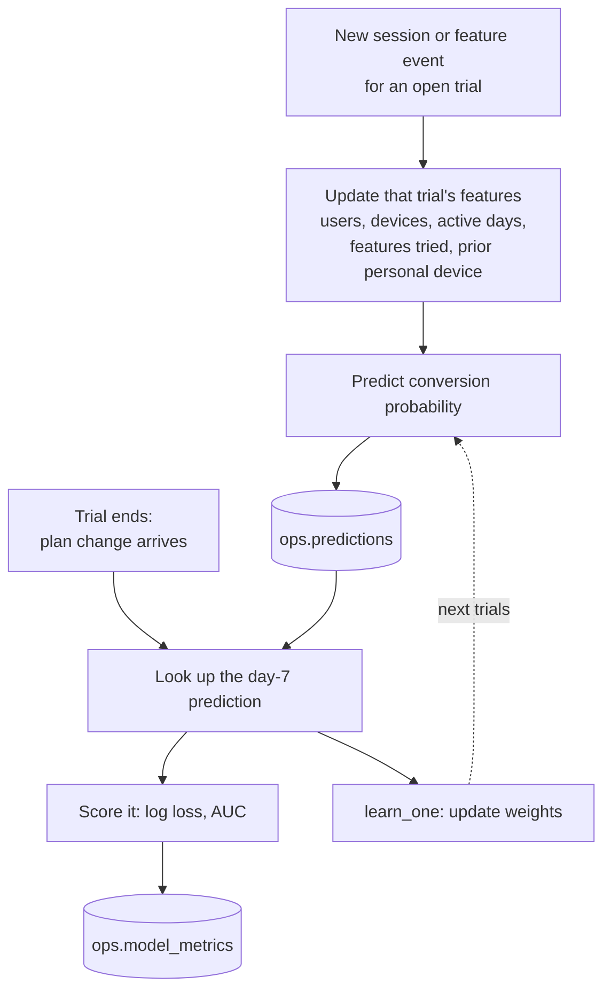
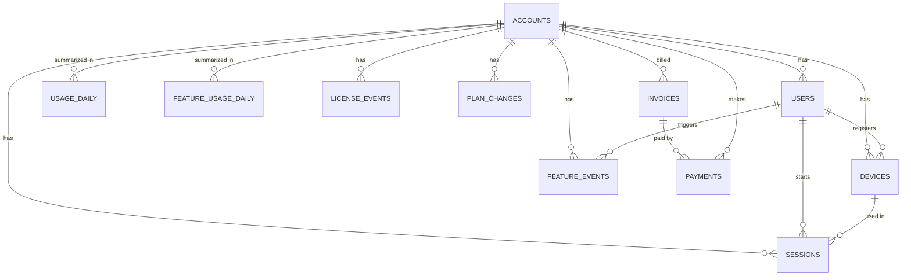

# How it works

Five diagrams, from the big picture down to a single take. They render directly on GitHub.

## 1. System overview

Where the data lives and which component writes and reads each part.

## 2. Data preparation and loading

How raw simulation output becomes a stream that reads as "today".

## 3. One live take

What happens during `make demo`, second by second.

## 4. Demo lifecycle

Why every take starts from the same state.

## 5. Trial model loop

Predict first, learn later. The model never sees an outcome before it happens.

## Schema at a glance

The core relationships. The generated `docs/img/erd.png` is the exact version with every column and foreign key.

