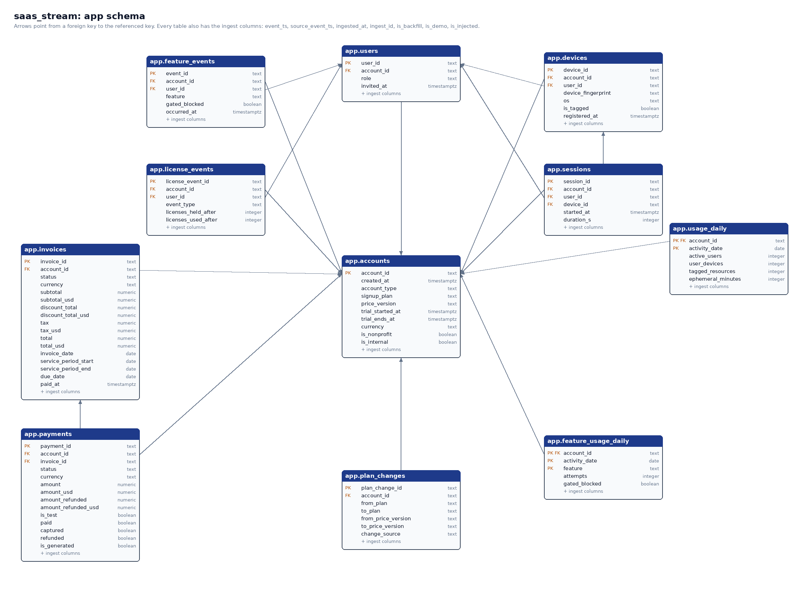
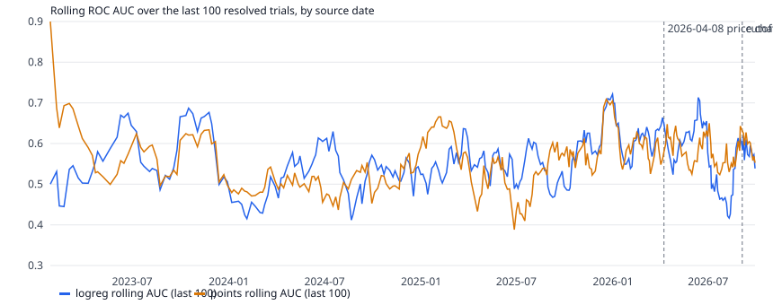

<!--
Screenshots to take (save under docs/img/ with these names), during a live take:
  dashboard-live.png        Live row, about 90 s into a take (after the session spike)
  dashboard-usage.png       Usage trends row (history plus today)
  dashboard-billing.png     Billing row
  dashboard-outliers.png    Outliers row, after the failure burst at 240 s
  dashboard-model.png       Trial model row (summary, top open trials, rolling AUC)
  demo-terminal.png         Terminal running `make demo`, showing the scripted anomaly lines
  azure-resources.png       Resource group in the Azure portal (crop the subscription ID)
-->

# Streaming analytics on Azure PostgreSQL: SaaS usage and trial conversion

Big Data Project 1. A live B2B SaaS data stream lands in Azure Database for PostgreSQL. On top of it run a Grafana dashboard, an outlier detector, and an online model that predicts which free trials will convert to paid plans.

The data is synthetic: it is derived from a separate synthetic simulation project, with every ID re-keyed and every timestamp shifted, and no real customer data is involved.

The product is a generic tool for connecting devices. Individuals use a free plan, teams pay per license, and business signups start a 14-day trial that either converts to a paid plan or falls back to free. The pipeline answers three questions: what is happening now, what looks wrong, and which open trials will convert.

## i. Schema

The database `saas_stream` runs on a Burstable B1ms Flexible Server (PostgreSQL 18) and has three schemas:

- `app` holds the streamed data: 9 tables with history (accounts, users, devices, daily usage, daily feature usage, license events, plan changes, invoices, payments) and 2 tables that only the live demo fills (sessions and feature events).
- `ops` holds component state and outputs: the demo state and cursor, the ingest log, consumer watermarks, injected anomalies, outlier flags, predictions, trial outcomes, and model metrics.
- `dash` holds the views Grafana reads. Grafana logs in as `grafana_ro`, which can read `dash` and nothing else. The local apps use `stream_rw`, and the admin role is used only for DDL.

Every `app` table carries the same ingest columns: `event_ts` (display time), `source_event_ts` (the time the scorer and model use), `ingested_at`, `ingest_id`, and the flags `is_backfill`, `is_demo`, and `is_injected`. `ingest_id` comes from one sequence shared by all app tables, so a consumer can read every table in insert order with a single watermark. Each table has a BRIN index on `ingested_at`, btree indexes on `ingest_id`, `event_ts`, and `source_event_ts`, and a partial index on demo rows so a reset can find them quickly.

Foreign keys tie every child table to `accounts` (nullable for payments). Devices, sessions, feature events, and license events also reference `users`; sessions reference `devices`, and payments reference `invoices`. That is 16 foreign keys in all.

The DDL is in `sql/ddl/schema.sql` and the views are in `sql/views/dash.sql`. `make db-init` applies both and is safe to rerun. `make erd` redraws the diagram from the live catalog.

## ii. Data generation and ingestion

The committed starting point is `data/prepared/`: nine Parquet files with generic names and re-keyed IDs. Two commands load and stream them.

**Baseline (`make baseline`).** This loads every prepared row before the cutoff (`SOURCE_CUTOFF`, 2026-09-04) with `COPY`, parents first: 1,252,924 rows across the nine history tables, in about 3.5 minutes on the B1ms. While loading, it injects anomalies at about one per 2,000 rows (517 in total; see section iv). It then runs the outlier scorer and the model over the whole history in a fast mode that uses the same per-row code as the live consumers, and saves a checkpoint: the model state as a pickle, plus the consumer watermarks and the highest ids in the ops tables.

**Time shift.** History is shifted forward by `DEMO_DATE - SOURCE_CUTOFF` days, so it always ends the day before the demo. On 2026-10-06 the shift is 32 days. The original time stays in `source_event_ts`, and the scorer and model only ever use that column, so the shift never changes a result.

**Live simulator (`make demo`).** The live demo turns the source records of the cutoff day into real-time events:

- each daily usage row becomes one session per active user, assigned to a real user and device of that account
- each daily feature row becomes one feature event per attempt
- that day's signups, user invites, devices, license events, plan changes, invoices, and payments arrive as single rows
- generated payments, sampled from the 30 days before the demo and re-keyed, arrive about every 10 seconds, with succeeded and failed in their historical ratio (3.6% failed)

The events are shuffled in a seeded random order (a child never arrives before its parent) and emitted with exponential gaps at a target of 500 events per minute. Every second, the events that are due go into the database in one transaction, together with the ingest log entry, any injected anomalies, and the emitter's cursor. A five-minute take inserts about 2,600 events: about 515 per minute including injected and generated rows. Live rows get `event_ts = now()`, and their other display times (signup, registration, session start) match it. One source day gives about 15 minutes of events.

**Consumers.** The outlier scorer and the model run in the same process as the emitter. Each polls every 5 seconds, reads new rows past its watermark in `ingest_id` order, and writes its outputs and its new watermark in one transaction. Outputs have unique keys and use `ON CONFLICT DO NOTHING`, so a repeated poll writes nothing twice. After a database error, a consumer rebuilds its state from the database before it continues. One Ctrl-C stops all three components cleanly.

**Reset and reproducibility.** `make demo-reset` deletes demo rows and every ops row written after the checkpoint, and restores the watermarks and the cursor. It takes about 3 seconds and refuses to run while a demo is live. Because the take is seeded, two takes after a reset produce the same events (same ids, order, values, and source times), the same anomalies, the same flags, and the same predictions. Only the wall-clock display times differ.

## iii. Dashboard

Azure Managed Grafana (Standard tier, Grafana 13) reads the `dash` views through `grafana_ro` and refreshes every 5 seconds. The dashboard JSON is committed at `grafana/dashboard.json`. It has six rows and 42 panels, and every panel query is a plain `SELECT` from one `dash` view.

1. **Live (last 15 minutes):** events per second, events per minute by table, sessions and active users per minute, feature events by feature, signups and payments per minute, demo status, and time into the current take.
2. **Stream health:** latency and size of each one-second flush, and rows per table.
3. **Usage trends:** active accounts and users over 7 days, and signups, trials, devices, and feature attempts per day. History comes from the daily tables, and today comes from live events rolled up to the day.
4. **Billing:** invoiced USD, payments succeeded and failed, and the failure rate.
5. **Outliers:** flags per minute by type, the latest 20 flags with their reasons, recall against injected anomalies, and precision by flag type.
6. **Trial model:** a summary by phase, the top 10 open trials by predicted probability, and rolling AUC and log loss for the model and the baseline.

Business panels leave out injected rows and test-mode payments, so they show what the business looks like rather than the test anomalies. Before this rule, the 7-day payment failure rate read 24.8%; with it, the rate is 4.0% (23 failed of 572). The outlier panels include injected rows by design.

## iv. Outlier detection

**Methods.** The scorer flags each row with rule checks for data errors and robust z-scores for unusual behavior. Every flag is written to `ops.outlier_flags` with a score and a plain reason.

- Rules: test-mode payment, payment with no invoice, invoice total below zero or payment amount at or below zero, more licenses used than held, and a duplicate payment (same account, invoice, amount, status, and time).
- Robust z-score: `|x - median| / max(1.4826 * MAD, floor)`. The floor stops a flat history (MAD of zero) from flagging every small change.
  - Activity spike: an account's daily active users against its last 28 days, with at least 7 days of history.
  - Failure rate: the payment failure rate of the current hour against the last 7 days. The floor is the normal random variation of a rate at the week's overall failure rate, so one failure among a few payments does not flag but a burst does.
  - Session rate (live only): an account's sessions this minute against its earlier minutes in the take.
  - Ingest volume: demo rows per minute against the last 30 minutes.

**Evaluation.** The baseline injects four kinds of anomaly into history: activity spikes (active users times 10), duplicate payments, negative invoices, and bursts of 20 failed payments in one hour. Each demo take adds one scripted anomaly of each live kind, at 60, 120, 180, and 240 seconds. Recall counts injected anomalies that raised the expected flag. Precision is measured against injected labels only: a flag on a row that was not injected counts as a false positive, even when it is a real oddity in the source. So precision here is a lower bound.

| Scope | Anomaly | Injected | Detected | Recall | Precision | Median delay |
|---|---|---:|---:|---:|---:|---:|
| History | activity spike | 132 | 106 | 0.80 | 0.41 | same row |
| History | duplicate payment | 136 | 136 | 1.00 | 1.00 | same row |
| History | negative invoice | 99 | 99 | 1.00 | 1.00 | same row |
| History | failure burst | 150 | 123 | 0.82 | 0.49 | same hour |
| Live take | session spike | 1 | 1 | 1.00 | 1.00 | 2.5 s |
| Live take | duplicate payment | 1 | 1 | 1.00 | 1.00 | 2.5 s |
| Live take | negative invoice | 1 | 1 | 1.00 | 1.00 | 2.6 s |
| Live take | failure burst | 1 | 1 | 1.00 | 1.00 | 2.6 s |

Live detection delay is the wall time from insert to flag, about 2.5 seconds. It is bounded by the scorer's 5-second polling interval.

**Threshold for activity spikes.** The z threshold was chosen by F1 on history:

| z threshold | Flags | Recall | Precision | F1 |
|---:|---:|---:|---:|---:|
| 3.5 | 2,985 | 0.96 | 0.04 | 0.08 |
| 5 | 775 | 0.94 | 0.16 | 0.27 |
| 7 (used) | 256 | 0.80 | 0.41 | 0.55 |

The other checks use 3.5. Naturally occurring hits in history include 105 payments without an invoice, 18 test-mode payments, and 34 hours of high payment failure. Those 34 hours are the source's monthly retry runs, which look just like injected bursts. The 27 missed bursts land on the day after such a run, when the previous week's few payments are almost all failures, so 20 more failures look normal.

## v. Trial conversion model

**Task.** For each business trial, predict whether it converts to a paid plan. The label is the trial's first resolution plan change: converted unless it falls back to free. The label becomes known only when that change arrives, around day 14 to 17. Trials still open when the data ends are left out, and accounts never carry their final plan.

**Model.** The model is an online logistic regression in River (a `StandardScaler` feeding a `LogisticRegression`), compared with a fixed points baseline that awards one point per sign of engagement. The features are built incrementally from app rows: active users and days, devices per user, tagged resources, gated feature attempts, distinct features, users invited, devices registered, operating systems, license adds, whether a device was seen before on a personal account, the price version, and the nonprofit flag. Count features use log1p, and the model trains with Adam (learning rate 0.003) and L2 regularization of 0.001. Live sessions and feature events update the same features that the daily rows build in history.

**Evaluation.** The evaluation is prequential. Each trial is scored with its latest prediction on or before day 7, and when its label arrives the model learns from that same day-7 vector. A trial with no prediction by day 7 would be scored at the running base rate, but every trial had one. The warm start covers all 2,835 trials before the cutoff, and the table uses its last 30% (after the model has warmed up). The holdout covers the 95 trials resolved after the cutoff, replayed with the same code. A five-minute take resolves about one trial, too few to evaluate. The constant reference always predicts the observed conversion rate, which it knows in advance, so it is a strict bar for log loss.

| Slice | Model | Trials | Log loss | AUC |
|---|---|---:|---:|---:|
| Warm start, last 30% | logistic regression | 851 | 0.633 | 0.587 |
| Warm start, last 30% | points baseline | 851 | 0.768 | 0.586 |
| Warm start, last 30% | constant | 851 | 0.655 | 0.500 |
| Holdout | logistic regression | 95 | 0.672 | 0.540 (95% CI 0.42 to 0.66) |
| Holdout | points baseline | 95 | 0.775 | 0.537 (95% CI 0.42 to 0.65) |
| Holdout | constant | 95 | 0.673 | 0.500 |

The confidence intervals come from 2,000 bootstrap resamples of the holdout trials. The holdout AUC difference between the two models is +0.003 (95% CI -0.10 to +0.11).

**How we got here.** The first version predicted conversion rates near zero. Its scaler had learned from feature vectors at the moment of the label, while it scored vectors from the middle of the trial. Training on the vector that is actually scored fixed the calibration. A second protocol scored each trial at its last prediction before the label, and it reached an AUC of 0.71. An ablation showed this was label timing: converted trials happened to be scored slightly later, and the model learned the day count. Scoring every trial at day 7 removed that effect, and the numbers above are the honest result.

**Conclusion.** The online model is well calibrated: it beats the constant on log loss in the warm start, ties it on the holdout, and beats the points baseline clearly on both. It ranks trials only slightly better than chance, and no better than the fixed baseline. Most of its signal comes from one feature: trials with a device previously seen on a personal account convert at 52.4% (624 trials, 21% of all), against 30.4% for the rest, and that feature has the largest weight in the model. In this data, first-week engagement says little else about conversion. With 95 holdout trials, the data cannot separate the two models.

## vi. Limitations

- **Synthetic data.** The data comes from a simulation, so conversion depends on whatever that simulation encoded. The weak engagement signal says more about the generator than about real customers.
- **Small live evaluation.** A take covers one source day and resolves about one trial. Model quality after the cutoff is measured on a 95-trial holdout replayed offline, and its AUC interval is wide.
- **Precision is a lower bound.** It counts only injected anomalies as true positives, so real oddities in the source count against it.
- **Failure-rate check.** It cannot tell an injected burst from the source's monthly retry runs, and it misses bursts that land right after one. It fires at most once per hour, so in a take (which spans one source hour) only the scripted burst can be detected.
- **Session-rate check.** It needs at least one earlier minute of the take, so nothing can flag in the first minute.
- **Single writer.** Consumers trust that one writer commits whole batches. A second concurrent writer could let a consumer skip rows.
- **Display times.** Live display timestamps are wall time, so two takes differ there by design. Everything the scorer and model use is reproducible.
- **Cut scope.** Ingest-stall injection (task 3.4) and the Hoeffding tree comparison (task 4.4) were cut. The ingest-volume check exists but was not tested with a real stall.
- **Size and cost.** Everything runs on the smallest burstable server. The baseline load takes about 3.5 minutes; a larger history would need a larger tier or a partitioned layout.
